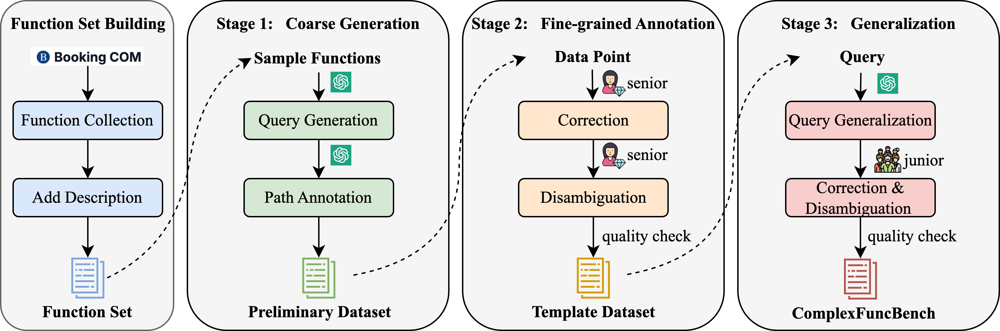
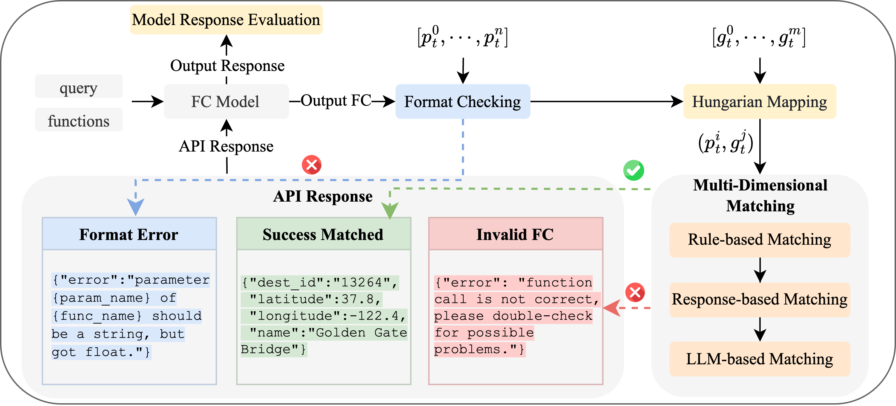

# Complex Function Calling Benchmark (ComplexFuncBench)

<p align="center">
📄<a href="https://arxiv.org/abs/2501.10132" target="_blank"> Arxiv Paper </a> • 🤗 <a href="https://huggingface.co/papers/2501.10132" target="_blank">HF Paper</a> • 📊 <a href="https://huggingface.co/datasets/THUDM/ComplexFuncBench" target="_blank">Dataset</a>
</p>


## Table of Contents

- [Introduction](#introduction)
- [Leaderboard](#Leaderboard)
- [Method](#Method)
- [How to evaluate on ComplexFuncBench](#how-to-evaluate-on-complexfuncbench)
- [Citation](#citation)

## Introduction

Complex Function Calling Benchmark (`ComplexFuncBench`) is specillly designed for complex function calling evaluation. The ComplexFuncBench dataset encompass 1,000 complex function calling samples from five aspects: (1) Function calling with **multi-step** in single turn; (2) Function calling with user-provided **constraints**; (3) Function calling that requires **parameter value reasoning** from implicit information; (4) Function calling with **long parameter values** that exceed 500 tokens; and (5) Function calling with **128k long-context** length.


The difference between `ComplexFuncBench` and other function calling benchmarks is shown in the following table.

|                    | Real API Response | Multi-Step | Constraints | Parameter Value Reasoning | Long Parameter Reasoning | Long-Context |
| :----------------: | :---------------: | :--------: | :---------: | :-----------------------: | :----------------------: | :----------: |
|     API-Bench      |         ❌         |     ❌      |      ❌      |             ❌             |            ❌             |      ❌       |
|     ToolBench      |         ✅         |     ✅      |      ❌      |             ❌             |            ❌             |      ❌       |
|       T-Eval       |         ✅         |     ✅      |      ❌      |             ❌             |            ❌             |      ❌       |
|        BFCL        |         ❌         |     ✅      |      ❌      |             ❌             |            ✅             |      ✅       |
|    Tool Sandbox    |         ❌         |     ✅      |      ❌      |             ❌             |            ❌             |      ❌       |
| `ComplexFuncBench` |         ✅         |     ✅      |      ✅      |             ✅             |            ✅             |      ✅       |

## Leaderboard

| Model                        | Overall Success Rate | Overall Call Acc. | Completeness | Correctness |
| :--------------------------- | :------------------: | :---------------: | :----------: | :---------: |
| Claude-3.5-Sonnet (20241022) |      **61.00**       |       79.27       |   **1.84**   |  **1.85**   |
| GPT-4o (2024-08-06)          |        60.50         |     **80.55**     |     1.66     |    1.75     |
| GLM-4-Long                   |        57.10         |       76.35       |     1.72     |    1.74     |
| GPT-4-Turbo (2024-04-09)     |        49.50         |       71.38       |     1.72     |    1.81     |
| Claude-3.5-Haiku (20241022)  |        45.80         |       69.50       |     1.79     |    1.71     |
| Qwen2.5-72B                  |        40.10         |       58.32       |     1.80     |    1.75     |
| Mistral Large 2              |        20.10         |       48.78       |     0.94     |     1.0     |
| GLM-4-9B                     |         9.40         |       27.97       |     1.15     |    1.03     |
| Qwen2.5-7B                   |         5.0          |       18.19       |     1.5      |    1.47     |
| Llama-3.1-405B               |         4.00         |       11.87       |     0.43     |    0.30     |
| Llama-3.1-70B                |         2.70         |       8.17        |     0.67     |    0.36     |
| Llama-3.1-8B                 |         0.10         |       1.34        |     0.18     |    0.09     |

## Method

### Data Collection

The collection of the ComplexFuncBench dataset consists of three stages: coarse generation, fine-grained annotation, and generalization. The dataset contains 1,000 complex function-calling samples, which comprise 600 single-domain samples and 400 cross-domain samples.



### Automated Evaluation

The automated evaluation framework \texttt{ComplexEval} evaluates models' complex function calling ability and response generation ability simultaneously.



## How to evaluate on ComplexFuncBench

### Preparation
First, download the repository and dataset. You can download the benchmarkd dataset through the [HuggingFace datasets](https://huggingface.co/datasets/THUDM/ComplexFuncBench).

```shell
git clone https://github.com/THUDM/ComplexFuncBench.git
cd ComplexFuncBench
```

Then, install the dependencies.

```shell
pip install -r requirements.txt
```


### Serve Model
- For close source models, make sure the corresponding model API keys are included in your evironments `.env` . To enable response-based evaluation, you need to subscribe the [Booking API](https://rapidapi.com/DataCrawler/api/booking-com15) from RapidAPI.

  ```shell
  OPENAI_API_KEY=sk-XXXXXX
  
  RAPID_API_KEY=
  ```

- For open source models,  you need to deploy your model via [vLLM](https://docs.vllm.ai/en/latest/serving/openai_compatible_server.html). Run the following command to serve the model. Take `THUDM/glm-4-9b-chat` for example:

  ```shell
  vllm serve THUDM/glm-4-9b-chat --api-key token-abc123 --tensor-parallel-size 4 --gpu-memory-utilization 0.95 --max_model_len 131072 --trust-remote-code
  ```

### Run Model Inference

```shell
python evaluation.py --model_name {model_name} --proc_num {proc_num}
```

Take `gpt-4o-2024-08-06` and `THUDM/glm-4-9b-chat` for example,

```shell
python evaluation.py --model_name gpt-4o-2024-08-06 --proc_num 50
```

```shell
python evaluation.py --model_name THUDM/glm-4-9b-chat --proc_num 50 --vllm_url http://xx.xx.xx.xx:8000/v1
```

The evaluation results is saved in `result/{model_name}`

### Export Results

```shell
python print_results.py --result_dir {result_dir}
```


## Citation
If you find our work helpful for your research, please consider citing our work.
```
@misc{zhong2025complexfuncbench,
      title={ComplexFuncBench: Exploring Multi-Step and Constrained Function Calling under Long-Context Scenario}, 
      author={Lucen Zhong and Zhengxiao Du and Xiaohan Zhang and Haiyi Hu and Jie Tang},
      year={2025},
      eprint={2501.10132},
      archivePrefix={arXiv},
      primaryClass={cs.CL},
      url={https://arxiv.org/abs/2501.10132}, 
}
```